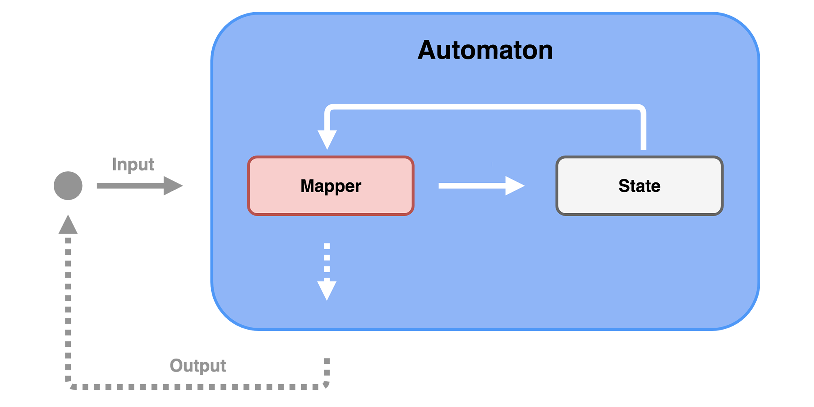

# Automaton

The Automaton is a framework for managing the state of the application. 

# About 

The name comes from main object that will be used in code - `Automaton`. The algorithm of its operation is presented below.

As you can see, there are 4 important objects to remember:
1. `Automaton` - represents the algorithm.
2. `State` - represents the state of entire application, it may consists of sub-states.
3. `Input` - represents the action that can be send, e.g. download data, save value, etc.
4. `Mapper` - used by algorithm to transform (State, Input) into (State, Output).

Let's explain communication between these objects. An object from view layer (it can be also an object from controller layer, view model layer, presenter layer, etc.) sends instance of `Input` to `Automaton`. Then `Mapper` uses current `State` and `Input` to return a new `State` with optional `Output` (which is just a postponed `Input`).

# Foundation

The algorithm is based on [Mealy machine](https://en.wikipedia.org/wiki/Mealy_machine), which is represented by six elements〈𝒬,𝑞,Σ,𝛿,Δ,𝜌〉, where:

* 𝒬 is set of states,
* 𝑞 is initial state,
* Σ is input set,
* 𝛿 is transition function,
* Δ is output set,
* 𝜌 is output function.

It was noticed that transition function and output function can be merged into a function called map function (it is represented by `map` method inside `Mapper`). Furthermore, the traditional Mealy machine communicates with the environment by sending outputs. However in this framework `Automaton` treats output as a postponed input and communicates with the enviroment by giving access to its state.

# Usage

For now there are two implementations: [Kotlin](Kotlin) and [Swift](Swift). Go there to see implementation details in your favorite language.

# Examples

* [Lessons](https://github.com/Nominalista/Lessons) - simple app for video playback. Written in Swift.
* [Expenses](https://github.com/Nominalista/Expenses) - more complex app for budget tracking. Written in Kotlin.

# Authors

Yasuhiro Inami ([@inamy](https://github.com/inamiy/)) is the original author of this idea presented on [iOS Conf SG](https://youtu.be/Oau4JjJP3nA). I tweaked it a little bit in order to make a genuine pattern.
